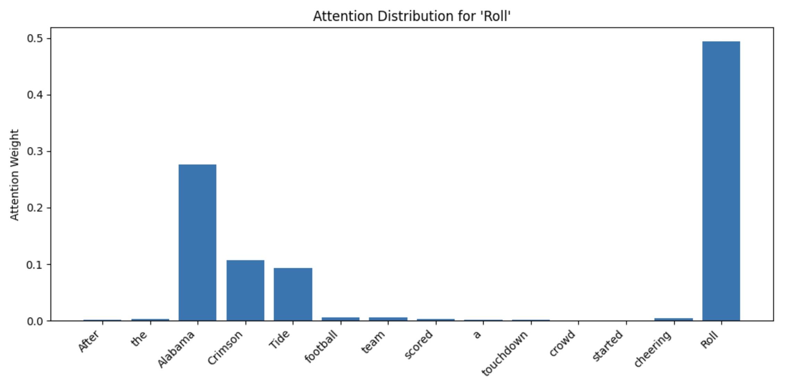

# Attention Mechanism from Scratch



*Self-attention weights for the token “Roll" that show how it focuses on contextually relevant words*


## Overview

This project demonstrates how the **self-attention mechanism** works in transformers, which is implemented step-by-step using NumPy.

Our task is to predict the next word in a sentence. This notebook uses the following sentence:

> *“After the Alabama Crimson Tide football team scored a touchdown, the crowd started cheering, ‘Roll ______’”*

Most readers would guess the missing word is **“Tide.”** This is based on the understanding of the context of the sentence.

*(For context: “Roll Tide” is a well-known chant associated with the University of Alabama.)*

To make this prediction, we naturally focus on important words like **“Alabama,” “Crimson,” and “Tide,”** and connect them to a familiar phrase.

A model uses a similar pattern: It figures out which words matter most, understands how they relate, and uses that information to predict the next word. This is the main idea behind how the self-attention mechanism works in modern language models.

This project walks through:
- Positional encodings
- Query, Key, Value (Q, K, V) construction
- Scaled dot-product attention
- Causal masking
- Softmax normalization + temperature scaling
- Attention visualization for individual tokens


## How It Works

### 1. Input Representation

We start with a sequence of token embeddings:

```math
X \in \mathbb{R}^{n \times d}
```


### 2. Compute Q, K, V

```math
Q = XW^Q, \quad K = XW^K, \quad V = XW^V
```

Each token is projected into:

- **Query:** what it is looking for
- **Key:** what it offers
- **Value:** what it passes along


### 3. Similarity Scores

```math
S = \frac{QK^T}{\sqrt{d_k}}
```

This measures how much each word relates to every other word.


### 4. Causal Masking

Future tokens are masked to prevent information leakage:

```python
if j > i:
    S[i, j] = -np.inf
```


### 5. Softmax to Attention Weights

```math
A = \text{softmax}(S)
```

Each row becomes a probability distribution.


### 6. Final Output

```math
\text{Output} = AV
```

Each token becomes a weighted combination of other tokens.


## Example Visualization

The notebook visualizes what a token attends to.

Example:

**"Roll" attends strongly to "Alabama", "Crimson", and "Tide"**, showing how attention captures contextual relationships.


## Tech Stack

- Python
- NumPy
- Matplotlib
- Jupyter Notebook


## How to Run

```bash
git clone https://github.com/your-username/attention-mechanism-from-scratch.git
cd attention-mechanism-from-scratch
pip install numpy matplotlib notebook
jupyter notebook
```


## Additional Notes
This notebook was designed to provide an educational understanding of how the attention mechanism works. Therefore, the following simplifications were made:

- Although this example does not explicitly predict the next word, the attention pattern reveals which words are most relevant.
- In practice, a trained model would use this information to make predictions, and would likely predict **“Tide”** based on learned patterns.
- The matrices and vectors in this notebook are manually designed for clarity; in real models, these values are learned automatically from data.
